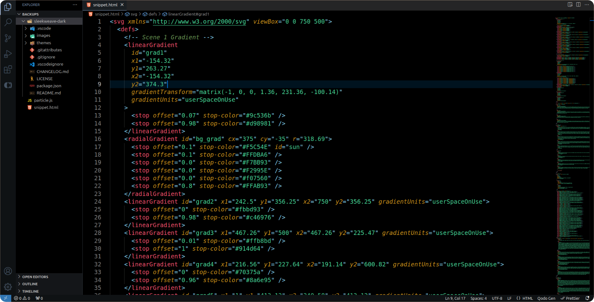
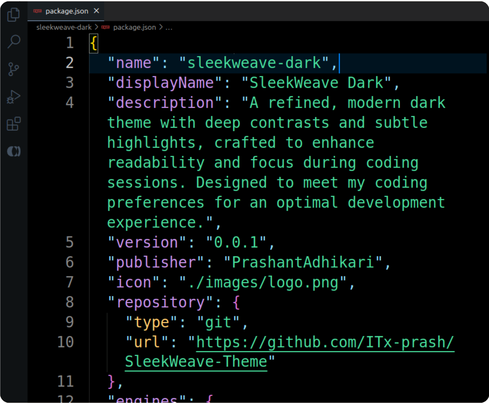

# SleekWeave Dark

## About

A refined, modern dark theme with deep contrasts and subtle highlights, crafted to enhance readability and focus during coding sessions. Designed to meet my coding preferences for an optimal development experience.

## Screenshots

## Installation

### Install from VSCode Marketplace 🛒

1. Press **Ctrl+Shift+X** to open Extensions in VSCode.
2. Search for **Sleek Weave Dark** and click **Install**.
3. Then select **Sleek Weave Dark** from the available themes list.

### Manual Installation 📂

1. Download this repository as a `.zip` file and extract it.
2. Move the extracted folder to your VSCode extensions directory:
   - **Windows**: `C:\Users\{YourUsername}\.vscode\extensions`
   - **macOS**: `~/.vscode/extensions`
   - **Linux**: `~/.vscode/extensions`
3. Restart Visual Studio Code.
4. Go to **Settings > Color Theme** and select **SleekWeave Dark** from the list.

## Features

- 🌑 Rich dark background for comfortable coding
- 🎨 Balanced color palette for clear syntax highlighting
- 🔍 Enhanced contrast for readability
- ✨ Efficient current line highlighting

## License

This theme is open source and available under the [MIT License](LICENSE).

**Enjoy coding with SleekWeave Dark! 🚀**
