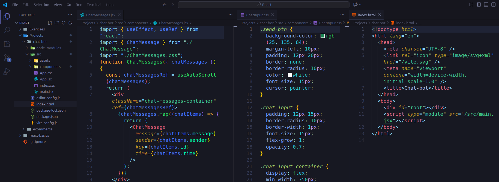
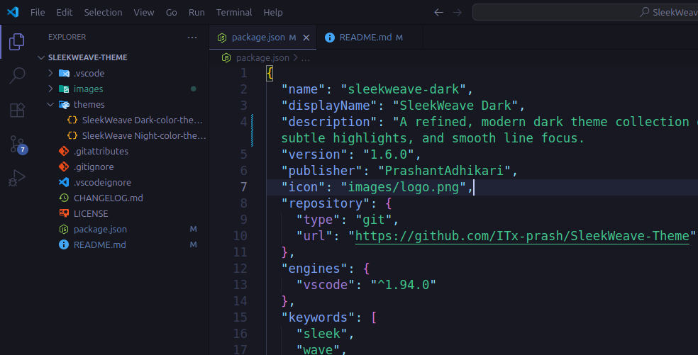
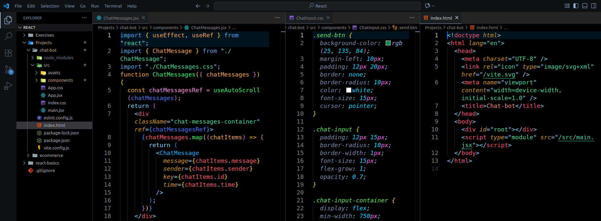
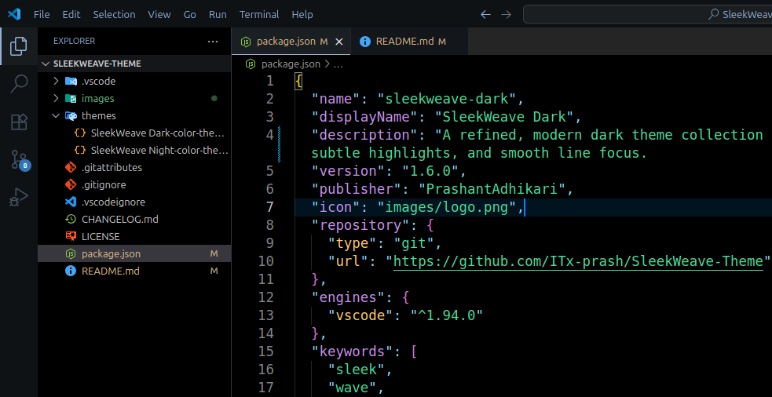

  

<h1 align="center">SleekWeave Theme</h1>

  <em>A refined, modern dark theme collection for VS Code</em>

  <a href="https://marketplace.visualstudio.com/items?itemName=PrashantAdhikari.sleekweave-dark">VS Code Marketplace</a> •
  <a href="https://github.com/ITx-prash/SleekWeave-Theme">GitHub</a> •
  <a href="https://github.com/ITx-prash/SleekWeave-Theme/issues">Report Issue</a>

---

SleekWeave Dark has evolved into **SleekWeave Theme**, now featuring a new theme variant: **SleekWeave Night**. Designed to meet my coding preferences for an optimal development experience.

## Theme Variants

### 🌙 SleekWeave Night

A sleek dark theme with softer purple and blue tones, designed for extended coding sessions with reduced eye strain.

---

### 🌑 SleekWeave Dark

The original variant, featuring a rich dark background with deep contrasts and a vibrant color palette for maximum code clarity and readability.

---

## Installation

### Install from VSCode Marketplace 🛒

1.  Press **Ctrl+Shift+X** to open Extensions in VSCode.
2.  Search for **SleekWeave Theme** and click **Install**.
3.  Open the Command Palette (**Ctrl+Shift+P**) and select **Preferences: Color Theme**.
4.  Choose your preferred variant:
    - **SleekWeave Night**
    - **SleekWeave Dark**

### Manual Installation 📂

1.  Download this repository as a `.zip` file and extract it.
2.  Move the extracted folder to your VSCode extensions directory:
    - **Windows**: `C:\Users\{YourUsername}\.vscode\extensions`
    - **Linux/macOS**: `~/.vscode/extensions`
3.  Restart Visual Studio Code.
4.  Go to **Settings > Color Theme** and select your preferred **SleekWeave** variant.

## Support

If you enjoy using SleekWeave Theme:
- ⭐ Star this repository on [GitHub](https://github.com/ITx-prash/SleekWeave-Theme)
- ✍️ Leave a review on the [VS Code Marketplace](https://marketplace.visualstudio.com/items?itemName=PrashantAdhikari.sleekweave-dark&ssr=false#review-details)
- 🐛 Report bugs or suggest features via [GitHub Issues](https://github.com/ITx-prash/SleekWeave-Theme/issues)

Your feedback and contributions are greatly appreciated!

## License

This theme is open source and available under the [MIT License](LICENSE).

---

**Enjoy coding with SleekWeave! 🚀**
