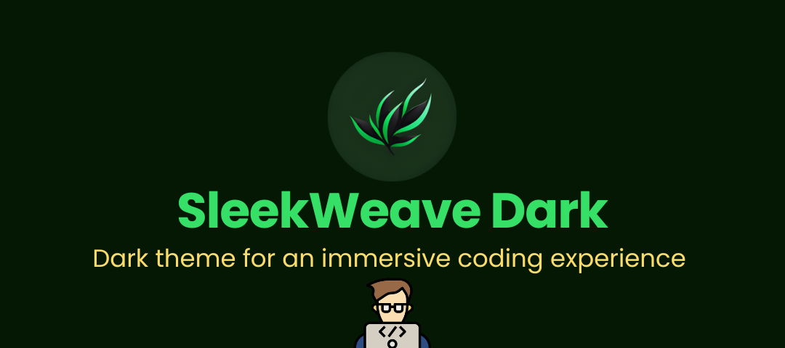

<h3 align="center">
	 
	
	SleekWeave Theme for <a href="https://code.visualstudio.com">VS Code</a>
	
</h3>

	
	
	

  <em>A refined, modern dark theme collection designed for an immersive coding experience</em>

---

	

SleekWeave Dark has evolved into **SleekWeave Theme**, introducing a new variant — **SleekWeave Night** — crafted to meet my coding preferences and for developers who value clarity, comfort, and modern aesthetics..

## Theme Variants

### 🌙 SleekWeave Night

A sleek dark theme with softer purple and blue tones, designed for extended coding sessions with reduced eye strain.

---

### 🌑 SleekWeave Dark

The original variant, featuring a rich dark background with deep contrasts and a vibrant color palette for maximum code clarity and readability.

---

## Installation

### Install from VSCode Marketplace 🛒

1.  Press **Ctrl+Shift+X** to open Extensions in VSCode.
2.  Search for **SleekWeave Theme** and click **Install**.
3.  Open the Command Palette (**Ctrl+Shift+P**) and select **Preferences: Color Theme**.
4.  Choose your preferred variant:
    - **SleekWeave Night**
    - **SleekWeave Dark**

### Manual Installation 📂

1.  Download this repository as a `.zip` file and extract it.
2.  Move the extracted folder to your VSCode extensions directory:
    - **Windows**: `C:\Users\{YourUsername}\.vscode\extensions`
    - **Linux/macOS**: `~/.vscode/extensions`
3.  Restart Visual Studio Code.
4.  Go to **Settings > Color Theme** and select your preferred **SleekWeave** variant.

---

	<strong>Enjoy coding with SleekWeave!</strong>

	

	<em>Crafted with 💚 on GNU/Linux</em>

	Copyright &copy; 2024-present <a href="https://github.com/ITx-prash" target="_blank">Prashant Adhikari</a>

	

